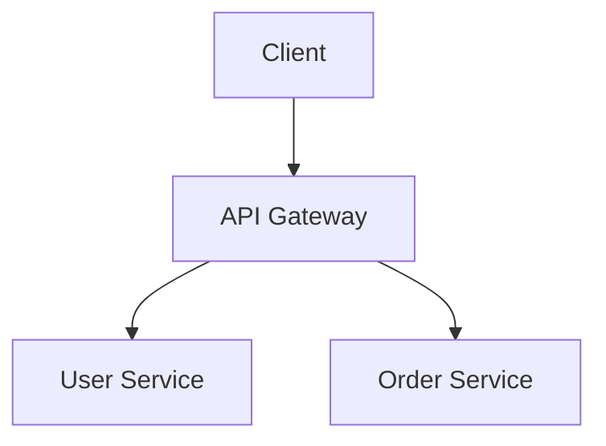

# go-zero Documentation Writing Guide

> 本文件供 AI 助手（GitHub Copilot、Cursor 等）在新增或修改文档时遵循。
> This file is the single source of truth for documentation conventions.
> For source-driven or multi-page documentation work, also use `docs-memory/` as the persistent documentation memory.

---

## 1. 技术栈与构建

| 项目 | 说明 |
|------|------|
| 框架 | **Astro + Starlight** |
| 构建 | `npm run build`（产出静态 HTML） |
| 本地预览 | `npm run dev` |
| 搜索 | Pagefind（构建时自动生成） |
| 图表 | Mermaid（\`\`\`mermaid 代码块，自动渲染） |
| 站点地址 | `https://go-zero.dev` |

---

## 2. 目录结构（6 个顶级分区）

```
src/content/docs/
├── index.mdx                   # 首页
├── concepts/                   # 1️⃣ 核心概念
├── getting-started/            # 2️⃣ 快速开始
│   └── installation/           #    安装子目录
├── guides/                     # 3️⃣ 指南（场景化教程）
│   ├── quickstart/
│   ├── http/
│   ├── grpc/
│   ├── database/
│   ├── microservice/
│   ├── queue/
│   ├── gateway/
│   ├── deployment/
│   ├── cron-job/
│   └── mcp/
├── components/                 # 4️⃣ 组件
│   ├── cache/
│   ├── resilience/
│   ├── concurrency/
│   ├── log/
│   ├── observability/
│   └── queue/
├── reference/                  # 5️⃣ 参考文档
│   ├── api-dsl/
│   ├── proto-dsl/
│   ├── cli-guide/
│   ├── goctl/
│   ├── configuration/
│   ├── customization/
│   └── releases/
├── community/                  # 6️⃣ 社区（FAQ + 贡献 + 示例）
│   └── faq/
├── examples/                   # 示例（归属 Community 侧边栏）
├── zh-cn/                      # 🇨🇳 中文镜像（结构 1:1 对应）
└── ko/                         # 🇰🇷 韩文镜像（结构 1:1 对应）
```

### 分区职责

| # | 分区 | 侧边栏标签 | 目的 |
|---|------|-----------|------|
| 1 | `concepts/` | Concepts / 核心概念 | 架构、设计原则、术语表 |
| 2 | `getting-started/` | Getting Started / 快速开始 | 环境安装、首次运行 |
| 3 | `guides/` | Guides / 指南 | 场景化 step-by-step 教程 |
| 4 | `components/` | Components / 组件 | 内置组件的原理与用法 |
| 5 | `reference/` | Reference / 参考文档 | DSL 语法、CLI 命令、配置参考、版本记录 |
| 6 | `community/` | Community / 社区 | FAQ、贡献指南、代码规范、示例 |

### 新增文档放哪里？

- **"怎样做 X"** → `guides/`（对应子目录）
- **"X 组件的工作原理"** → `components/`
- **"X 命令/配置/语法字段"** → `reference/`
- **"X 常见问题"** → `community/faq/`
- **"X 设计理念"** → `concepts/`

---

## 3. 多语言要求（EN + zh-CN + ko）

- 英文文档放 `src/content/docs/` 根目录。
- 中文镜像放 `src/content/docs/zh-cn/`，**目录结构 1:1 完全对应**。
- 韩文镜像放 `src/content/docs/ko/`，**目录结构 1:1 完全对应**。
- **每新增一个英文 `.md`，必须同时新增对应的 `zh-cn/` 和 `ko/` 翻译文件。**
- 中文 frontmatter 的 `title` 和 `description` 必须翻译为中文。
- 韩文 frontmatter 的 `title` 和 `description` 必须翻译为韩文。
- 中文正文使用中文书写；代码块、命令、变量名保持英文不翻译。
- 韩文正文使用韩文书写；代码块、命令、变量名保持英文不翻译。

## 3.1 文档记忆工作流

当文档修改来自版本发布、源码变更、Issue、PR、外部文章、社区反馈或跨页面梳理时，使用 `docs-memory/`：

1. 将原始材料保存为 `docs-memory/sources/` 下的 source packet。
2. 编辑前先阅读 `docs-memory/index.md`，定位相关页面和已知缺口。
3. 修改 `src/content/docs/` 下的公开文档，而不是只生成一次性回答。
4. 如果新增重要主题、页面族或 source packet，更新 `docs-memory/index.md`。
5. 在 `docs-memory/log.md` 追加一条日期化记录，说明本次 ingest、query 或 lint pass。

`src/content/docs/` 是发布层；`docs-memory/` 是 AI/维护者用于持续积累上下文的工作台。

`docs-memory/reports/` 下的 drift report 是源码变更审查队列。处理时先阅读 report 中列出的 upstream 文件，再决定是否更新公开文档。

---

## 4. Frontmatter 规范

每个 `.md` / `.mdx` 文件必须以 YAML frontmatter 开头：

```yaml
---
title: Circuit Breaker          # 页面标题（zh-cn 文件用中文，ko 文件用韩文）
description: Prevent cascading failures with automatic circuit breaking.
sidebar:
  order: 2                      # 数字越小越靠前
---
```

### 规则

| 字段 | 必填 | 说明 |
|------|------|------|
| `title` | ✅ | 简洁的页面标题。EN 用英文，zh-cn 用中文，ko 用韩文 |
| `description` | ✅ | 一句话描述，用于 SEO 和搜索摘要 |
| `sidebar.order` | ✅ | 决定在侧边栏中的排序位置 |
| `sidebar.label` | ❌ | 仅当侧边栏显示名需要和 title 不同时使用 |

### Index 文件

每个目录必须有 `index.md`，用作该分区的入口页：

```yaml
---
title: HTTP Guide               # zh-cn: HTTP 指南；ko: HTTP 가이드
description: Build, configure, and extend HTTP services with go-zero.
sidebar:
  order: 1                      # index 通常 order: 1
---
```

---

## 5. 内容编写规范

### 5.1 标题层级

- **不要**在正文顶部重复写 `# 标题`（Starlight 已从 frontmatter `title` 自动生成 h1）。
  - 例外：如果需要比 frontmatter `title` 更长的标题，可以写 `# ...`，但不要两者完全一样。
- 正文从 `## 二级标题` 开始。
- 最多到 `####`（四级），不要用更深的标题。

### 5.2 代码示例

- 所有 Go 代码使用 ` ```go ` 标注语言。
- 代码应可直接运行或复制，避免省略号 `...` 占位。
- 配置示例用 ` ```yaml ` 或 ` ```toml `。
- Shell 命令用 ` ```bash `。
- 代码注释用英文（即使在 zh-cn 文档中）。

```go
// Good — complete, runnable
func main() {
    conf := rest.RestConf{
        Host: "0.0.0.0",
        Port: 8080,
    }
    server := rest.MustNewServer(conf)
    defer server.Stop()
    server.Start()
}
```

### 5.3 表格

优先用表格展示对比信息、配置字段、参数列表：

```markdown
| 参数 | 类型 | 默认值 | 说明 |
|------|------|--------|------|
| `Host` | string | `"0.0.0.0"` | 监听地址 |
| `Port` | int | `8080` | 监听端口 |
```

### 5.4 内部链接

- 使用**相对路径**链接到其他文档：`[Circuit Breaker](../resilience/circuit-breaker.md)`。
- **不要**使用绝对 URL 路径如 `/docs/components/...`。
- **不要**使用裸 slug 如 `components/resilience/circuit-breaker`。
- 链接到其他分区时注意正确的 `../` 层级关系。

### 5.5 图表

Mermaid 图表直接写在代码块中：

````markdown

````

### 5.6 提示框（Admonitions）

使用 Starlight 内置的提示框语法：

```markdown
:::note
This is a note.
:::

:::tip
This is a tip.
:::

:::caution
This is a caution.
:::

:::danger
This is a danger warning.
:::
```

---

## 6. 侧边栏配置

侧边栏在 `astro.config.mjs` 的 `sidebar` 数组中配置。

### 两种模式

1. **autogenerate** — 自动扫描目录，按 `sidebar.order` 排序：
   ```js
   { autogenerate: { directory: 'guides/http' } }
   ```
2. **显式列表** — 手动指定顺序和 slug：
   ```js
   { slug: 'concepts/architecture' }
   ```

### 新增子目录

如果你新增了一个 `guides/` 下的子目录（如 `guides/websocket/`），需要：

1. 在 `astro.config.mjs` → `sidebar` → Guides 的 `items` 数组中增加：
   ```js
   {
     label: 'WebSocket',
     translations: { 'zh-CN': 'WebSocket', ko: 'WebSocket' },
     autogenerate: { directory: 'guides/websocket' },
   },
   ```
2. 确保新目录有 `index.md`。
3. `zh-cn/guides/websocket/` 和 `ko/guides/websocket/` 镜像同步新增。

### 翻译标签

每个侧边栏条目都需要 `translations` 字段提供中文和韩文标签：

```js
{
  label: 'HTTP Service',           // 英文
  translations: { 'zh-CN': 'HTTP 服务', ko: 'HTTP 서비스' },
  autogenerate: { directory: 'guides/http' },
}
```

---

## 7. 命名约定

| 项目 | 约定 | 示例 |
|------|------|------|
| 文件名 | 小写 kebab-case | `circuit-breaker.md` |
| 目录名 | 小写 kebab-case | `getting-started/` |
| 入口文件 | `index.md` | `guides/http/index.md` |
| 图片 | `src/assets/` 或 `public/resource/` | `src/assets/logo.png` |

---

## 8. 提交规范

| 类型 | 前缀 | 示例 |
|------|------|------|
| 新增文档 | `docs:` | `docs: add WebSocket guide` |
| 修复链接/内容 | `docs:` | `docs: fix broken link in cache index` |
| 站点配置 | `chore:` | `chore: add WebSocket to sidebar` |
| 样式改动 | `style:` | `style: adjust code block spacing` |

---

## 9. 预提交检查清单

在提交前确认以下事项：

- [ ] `npm run build` 无报错
- [ ] `npm run validate` 无报错
- [ ] 新增英文文档在 `zh-cn/` 和 `ko/` 有对应翻译
- [ ] Frontmatter 包含 `title`、`description`、`sidebar.order`
- [ ] zh-cn/ko 文件的 `title` 和 `description` 已翻译为对应语言
- [ ] 内部链接使用相对路径且可正确跳转
- [ ] 新目录已加入 `astro.config.mjs` 的 sidebar 配置
- [ ] 新侧边栏条目包含 `translations: { 'zh-CN': '...', ko: '...' }`
- [ ] 代码示例完整可运行，语言标注正确
- [ ] 目录下有 `index.md` 入口文件
- [ ] Source-driven changes have updated `docs-memory/index.md` and `docs-memory/log.md`

---

## 10. 文件模板

### 新增指南页面

```markdown
---
title: WebSocket Service
description: Build real-time WebSocket services with go-zero.
sidebar:
  order: 3
---

## Overview

Brief intro to what this guide covers.

## Prerequisites

- go-zero v1.7+
- Basic knowledge of HTTP services

## Step 1: Create the project

` ` `bash
goctl api new websocket-demo
` ` `

## Step 2: Implement the handler

` ` `go
func WebSocketHandler(w http.ResponseWriter, r *http.Request) {
    // implementation
}
` ` `

## What's Next

- [Deployment Guide](../deployment/docker.md)
- [Configuration Reference](../../reference/configuration/api-config.md)
```

### 新增组件页面

```markdown
---
title: Bloom Filter
description: Probabilistic data structure for membership testing in go-zero.
sidebar:
  order: 5
---

## How It Works

Explain the concept and go-zero's implementation.

## Usage

` ` `go
filter := bloom.New(1000)
filter.Add([]byte("key"))
exists := filter.Exists([]byte("key"))
` ` `

## Configuration

| Option | Type | Default | Description |
|--------|------|---------|-------------|
| `bits` | int | `1024` | Number of bits |

## Best Practices

- When to use it
- When NOT to use it
```

---

## 11. 常见错误

| ❌ 错误做法 | ✅ 正确做法 |
|-------------|------------|
| 只写英文不写翻译 | EN + zh-cn + ko 同时新增 |
| 绝对路径 `/docs/guides/http` | 相对路径 `../http/basic.md` |
| 缺少 frontmatter | 始终包含 title + description + sidebar.order |
| 目录没有 index.md | 每个目录必须有 index.md |
| 代码块不标语言 | 始终标注 ` ```go ` / ` ```bash ` 等 |
| 翻译文件用英文 title | zh-cn/ko 的 title/description 必须翻译 |
| 新目录不改 sidebar 配置 | 同步更新 `astro.config.mjs` |
