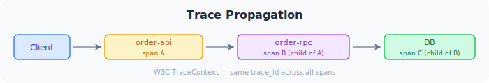

go-zero uses OpenTelemetry for distributed tracing. Spans are created automatically for every inbound HTTP request, outbound zrpc call, and SQL query — no instrumentation code required for the happy path.

:::tip
Looking for a hands-on tutorial? See the [Distributed Tracing Guide](/guides/microservice/distributed-tracing/) for a step-by-step walkthrough with Jaeger.
:::

## Configuration

```yaml title="etc/app.yaml"
Telemetry:
  Name: order-api             # service name shown in the trace UI
  Endpoint: localhost:4317     # OTLP gRPC endpoint
  Sampler: 1.0                # 1.0 = 100% sampling; use 0.1 in high-traffic production
  Batcher: otlpgrpc           # see Backends table below
```

## What Is Traced Automatically

| Layer | Span details |
|-------|-------------|
| Inbound HTTP request | URL, method, HTTP status code |
| Outbound zrpc call | gRPC service + method name |
| SQL queries (via `sqlx`) | query string, rows affected |
| Redis commands | command name, key prefix |

## Trace Propagation

go-zero propagates trace context between services using the **W3C TraceContext** standard (`traceparent` header). When an API service calls an RPC service, the trace ID and span ID flow automatically — the entire call chain appears as a single trace in Jaeger or Zipkin.



No code is needed on the RPC server side — the gRPC interceptor extracts the context from incoming metadata automatically.

## Custom Spans

Add application-level spans inside your logic:

```go
import (
    "go.opentelemetry.io/otel"
    "go.opentelemetry.io/otel/attribute"
    "go.opentelemetry.io/otel/codes"
)

func (l *OrderLogic) processPayment(amount int64) error {
    tracer := otel.Tracer("order-service")
    ctx, span := tracer.Start(l.ctx, "process-payment")
    defer span.End()

    span.SetAttributes(
        attribute.Int64("amount", amount),
        attribute.String("currency", "USD"),
        attribute.String("provider", "stripe"),
    )

    if err := chargeCard(ctx, amount); err != nil {
        span.RecordError(err)
        span.SetStatus(codes.Error, err.Error())
        return err
    }
    return nil
}
```

## Trace ID in Logs

When both `logx` and `Telemetry` are configured, go-zero injects the trace ID and span ID into every log line automatically:

```json
{"level":"info","trace_id":"4bf92f3577b34da6a3ce929d0e0e4736","span_id":"00f067aa0ba902b7","msg":"order created","orderId":"ord_123"}
```

This means you can jump from a Jaeger trace span straight to the logs for that specific request.

## Sampling Strategies

| Strategy | Config | When to use |
|---|---|---|
| Always sample | `Sampler: 1.0` | Development, staging |
| 10% sample | `Sampler: 0.1` | High-traffic production |
| Head-based ratio | `Sampler: 0.01` | Very high throughput (>10k req/s) |

A ratio sampler makes the decision at the trace root (the API gateway). All downstream spans in the same trace are automatically included or excluded together.

## Backends

| Backend | `Batcher` value | Endpoint format |
|---------|----------------|-----------------|
| OTLP gRPC | `otlpgrpc` (default) | `otel-collector:4317` |
| OTLP HTTP | `otlphttp` | `http://otel-collector:4318` |
| Zipkin | `zipkin` | `http://zipkin:9411/api/v2/spans` |
| File | `file` | (writes to local file) |

:::caution
The `jaeger` batcher was removed in **go-zero v1.10.0** ([#5361](https://github.com/zeromicro/go-zero/pull/5361)) because the OpenTelemetry Jaeger exporter has been officially deprecated. If you upgrade to v1.10.0+ with `Batcher: jaeger`, the service will fail to start with:

```
value "jaeger" is not defined in options "[zipkin otlpgrpc otlphttp file]"
```

See [Migrating from Jaeger Batcher](#migrating-from-jaeger-batcher) below.
:::

### Jaeger via OTLP (Docker)

Jaeger 1.35+ natively accepts OTLP. Use the `all-in-one` image with OTLP enabled:

```bash
docker run -d --name jaeger \
  -e COLLECTOR_OTLP_ENABLED=true \
  -p 16686:16686 \
  -p 4317:4317 \
  -p 4318:4318 \
  jaegertracing/all-in-one:latest
# UI: http://localhost:16686
```

```yaml title="etc/app.yaml"
Telemetry:
  Name: order-api
  Endpoint: localhost:4317
  Sampler: 1.0
  Batcher: otlpgrpc
```

### OpenTelemetry Collector

For production, route traces through the OTel Collector to fan out to multiple backends:

```yaml title="etc/app.yaml"
Telemetry:
  Name: order-api
  Endpoint: otel-collector:4317
  Batcher: otlpgrpc
  Sampler: 0.1
```

## Disable Tracing

Set `Sampler: 0` or remove the `Telemetry` block entirely to disable all tracing overhead.

## Migrating from Jaeger Batcher

Starting from **go-zero v1.10.0**, the `jaeger` batcher has been removed because the upstream [OpenTelemetry Jaeger exporter is deprecated](https://opentelemetry.io/blog/2023/jaeger-exporter-collector-migration/). Jaeger itself has adopted OTLP as its native protocol since v1.35, so you can continue using Jaeger — just switch to the OTLP exporter.

### Step 1: Update the Docker Compose / Jaeger Deployment

Make sure your Jaeger instance exposes the OTLP ports (`4317` for gRPC, `4318` for HTTP):

```yaml title="docker-compose.yaml"
services:
  jaeger:
    image: jaegertracing/all-in-one:latest
    environment:
      - COLLECTOR_OTLP_ENABLED=true
    ports:
      - "16686:16686"   # Jaeger UI
      - "4317:4317"     # OTLP gRPC
      - "4318:4318"     # OTLP HTTP
    restart: unless-stopped
```

:::tip
If ports `4317`/`4318` conflict with other services on your host, map them to different host ports (e.g. `34317:4317`) and update the `Endpoint` accordingly.
:::

### Step 2: Update Your YAML Config

Replace the old Jaeger-specific configuration with OTLP:

```diff
 Telemetry:
   Name: my-service
-  Endpoint: http://jaeger:14268/api/traces
-  Batcher: jaeger
+  Endpoint: jaeger:4317
+  Batcher: otlpgrpc
   Sampler: 1.0
```

Or use OTLP HTTP:

```diff
 Telemetry:
   Name: my-service
-  Endpoint: http://jaeger:14268/api/traces
-  Batcher: jaeger
+  Endpoint: http://jaeger:4318
+  Batcher: otlphttp
   Sampler: 1.0
```

### Step 3: Restart and Verify

Restart your service and open the Jaeger UI at `http://localhost:16686`. Your traces should appear exactly as before — the only difference is the transport protocol.

### Quick Reference

| Before (< v1.10.0) | After (>= v1.10.0) |
|---------------------|---------------------|
| `Batcher: jaeger` | `Batcher: otlpgrpc` (recommended) or `otlphttp` |
| `Endpoint: http://jaeger:14268/api/traces` | `Endpoint: jaeger:4317` (gRPC) or `http://jaeger:4318` (HTTP) |
| Jaeger image: any version | Jaeger image: **1.35+** (for native OTLP support) |
