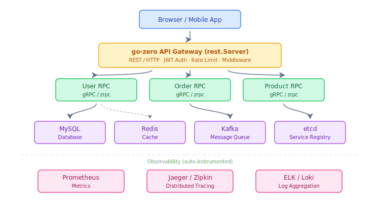
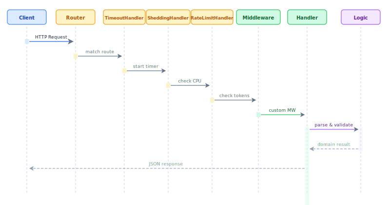
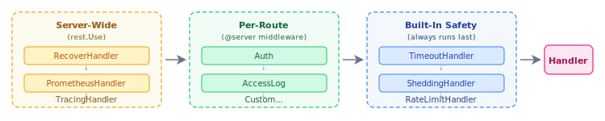
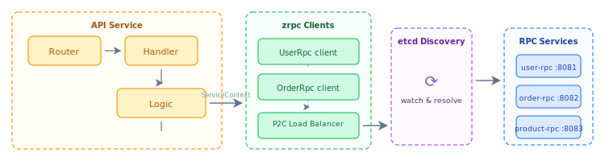
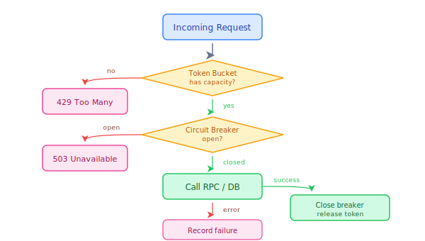
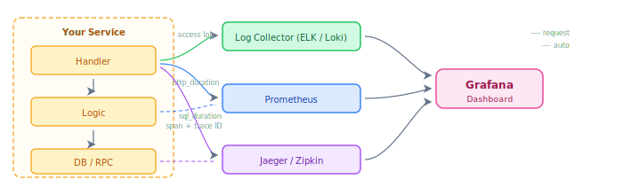

go-zero is a cloud-native microservices framework built around a layered design that separates concerns while keeping each layer thin and replaceable.

## 1. System Overview



## 2. HTTP Request Lifecycle

Every incoming HTTP request flows through a fixed pipeline before reaching your business logic:



**What each layer does:**

| Layer | Component | Purpose |
|---|---|---|
| Timeout | `TimeoutHandler` | Enforce per-request deadline (config: `Timeout`) |
| Load shedding | `SheddingHandler` | Reject requests when CPU > threshold |
| Rate limiting | `RateLimitHandler` | Token-bucket rate limiter per route |
| Middleware | Your code | Auth, logging, CORS, etc. |
| Handler | Generated | Unmarshal request → call Logic |
| Logic | Your code | Business rules, DB/RPC calls |

## 3. Middleware Chain Execution Order



Server-wide middleware is registered via `server.Use(...)` and runs for every request. Per-route middleware is declared in the `.api` file's `@server` block and generated into `ServiceContext`. Built-in safety handlers always run last before your handler code.

## 4. API Gateway → RPC Wiring

goctl generates the full wiring between the HTTP layer and RPC clients:



`ServiceContext` is the dependency injection container. It holds all RPC clients, DB connections, cache references, and config. Both handler and logic layers share it via a pointer.

## 5. Resilience: Rate Limiting & Circuit Breaking



go-zero's circuit breaker uses a **sliding-window** failure counter. The breaker opens when the error ratio in the past 10 seconds exceeds the configured threshold (default: 50%). In half-open state it lets one probe request through.

**Configuration:**

```yaml
# Automatically applied to every zrpc call and every outbound HTTP call
# No explicit config needed — go-zero enables it by default
```

## 6. Observability Pipeline

go-zero instruments every layer automatically:



**Enabling:**

```yaml title="etc/app.yaml"
# Structured logging (always on)
Log:
  ServiceName: order-api
  Mode: file          # console | file
  Level: info
  Encoding: json

# Metrics
Prometheus:
  Host: 0.0.0.0
  Port: 9101
  Path: /metrics

# Distributed tracing
Telemetry:
  Name: order-api
  Endpoint: http://jaeger:14268/api/traces
  Sampler: 1.0        # 1.0 = 100% sampling
  Batcher: jaeger
```

All logs carry a `trace_id` and `span_id` field that correlate with Jaeger traces — no manual instrumentation required.

## Next Steps

- [Design Principles](../design-principles) — how go-zero enforces these layers
- [Distributed Tracing tutorial](../../guides/microservice/distributed-tracing) — hands-on Jaeger setup
- [Circuit Breaker component](../../components/resilience/circuit-breaker) — configuration reference
