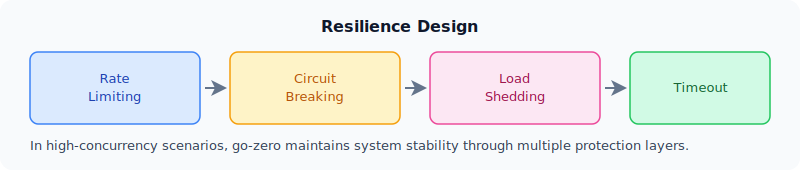

# Design Principles

## Convention Over Configuration

goctl scaffolding and standard folders reduce team-level divergence and improve collaboration efficiency. Every engineer working on a go-zero project finds the same layout:

```text
internal/handler/   ← HTTP binding only
internal/logic/     ← business logic only
internal/svc/       ← shared dependencies
internal/model/     ← data access only
```

When the layout is non-negotiable, code reviews focus on substance rather than style.

## Stability by Default

Resilience mechanisms are built in as framework capabilities, not optional add-ons. Circuit breaking, rate limiting, load shedding, and timeout control activate automatically with zero configuration:

```go
// This single line is protected by:
// - P2C load balancing
// - circuit breaker (Google SRE style)
// - per-RPC deadline from ctx
// - Prometheus metrics
// - OpenTelemetry span
resp, err := l.svcCtx.OrderRpc.CreateOrder(l.ctx, req)
```



## Clear Responsibility Boundaries

Handlers, logic modules, service context, and models are intentionally separated to reduce coupling:

```go
// handler — only decodes request and calls logic
func (h *CreateOrderHandler) ServeHTTP(w http.ResponseWriter, r *http.Request) {
    var req types.CreateOrderReq
    if err := httpx.Parse(r, &req); err != nil {
        httpx.ErrorCtx(r.Context(), w, err)
        return
    }
    l := logic.NewCreateOrderLogic(r.Context(), h.svcCtx)
    resp, err := l.CreateOrder(&req)
    httpx.OkJsonCtx(r.Context(), w, resp)
}

// logic — only implements business rules
func (l *CreateOrderLogic) CreateOrder(req *types.CreateOrderReq) (*types.CreateOrderResp, error) {
    // validate, call model, call downstream RPC
    order, err := l.svcCtx.OrderModel.Insert(l.ctx, &model.Order{
        UserId:  req.UserId,
        Product: req.Product,
    })
    if err != nil {
        return nil, err
    }
    return &types.CreateOrderResp{OrderId: order.Id}, nil
}
```

This boundary is enforced by code generation — goctl never puts business logic in handlers.

## Observability-first Execution

Production-grade systems need logs, metrics, and traces from day one, not after incidents happen. go-zero injects all three into every request automatically:

```go
// logx writes trace_id + span_id into every log line automatically
logx.Infow("order created", logx.Field("orderId", id))
// JSON output: {"level":"info","trace_id":"4bf92f35...","span_id":"00f067aa","orderId":"ord_123"}

// Prometheus counter incremented per request/response code — no code needed
// go_zero_http_server_requests_total{method="POST",path="/order",code="200"}
```

Enable distributed tracing by adding four lines to `etc/user-api.yaml`:

```yaml
Telemetry:
  Name: user-api
  Endpoint: http://jaeger:14268/api/traces
  Sampler: 1.0
```
