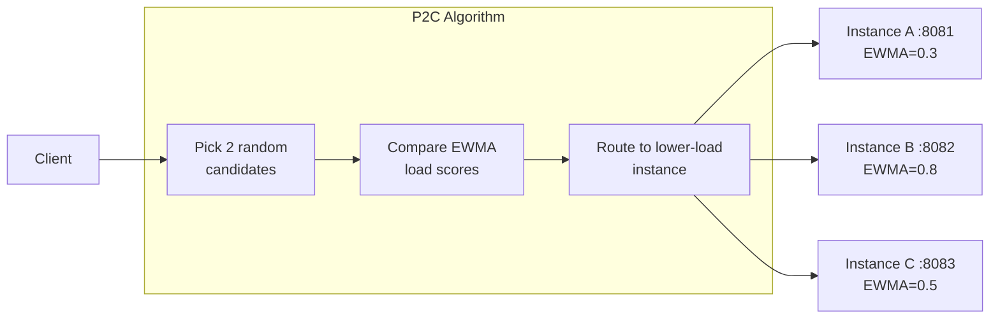

go-zero uses **P2C (Power of Two Choices)** with **EWMA load estimation** as its default load balancer. This algorithm is statistically superior to round-robin under bursty or heterogeneous traffic patterns.

## How P2C + EWMA Works



1. From all available instances, randomly pick **two** candidates.
2. Compare their **EWMA (Exponentially Weighted Moving Average)** load score.
3. Route the request to the **lower-load** instance.
4. After the response, update EWMA with the actual round-trip time.

**Why better than round-robin?**
- Round-robin distributes *requests*, not *load*. Slow instances pile up.
- P2C routes away from slow instances automatically, without global coordination.

## Automatic Activation

P2C is active by default whenever service discovery (etcd) is used — **no extra config needed**:

```yaml title="etc/api.yaml"
OrderRpc:
  Etcd:
    Hosts:
      - 127.0.0.1:2379
    Key: order.rpc
```

Scale up your RPC service and go-zero automatically discovers the new instance and includes it in the P2C pool within seconds.

## Static Endpoints (Dev / Testing)

For local development without etcd, list endpoints directly. go-zero uses a simple **round-robin** policy for static endpoints:

```yaml
OrderRpc:
  Endpoints:
    - 127.0.0.1:8080
    - 127.0.0.1:8081
    - 127.0.0.1:8082
```

## Direct Connection (Single Instance)

```yaml
OrderRpc:
  Target: "direct://127.0.0.1:8080"
```

## Kubernetes DNS

When running on Kubernetes, use the DNS-based balancer (round-robin across pod IPs):

```yaml
OrderRpc:
  Target: "k8s://order-rpc-svc.default:8080"
```

## Observing the Balancer

go-zero exposes per-instance Prometheus metrics that let you verify P2C is working:

```yaml title="etc/api.yaml"
Prometheus:
  Host: 0.0.0.0
  Port: 9101
  Path: /metrics
```

Key metrics:

| Metric | Description |
|---|---|
| `rpc_client_requests_total{target="..."}` | Request count per upstream instance |
| `rpc_client_duration_ms_bucket{target="..."}` | Latency histogram per instance |

A healthy P2C deployment will show roughly equal request distribution across instances. If one instance is slow, its `rpc_client_duration_ms` p99 will rise and P2C will naturally route fewer requests to it.

## Timeout and Keep-alive

```yaml
OrderRpc:
  Etcd:
    Hosts: [127.0.0.1:2379]
    Key: order.rpc
  Timeout: 2000           # client-side request deadline (ms)
  KeepaliveTime: 20000    # gRPC keepalive ping interval (ms)
```

If a request exceeds `Timeout`, go-zero cancels it, records the failure in the circuit breaker, and returns a `DeadlineExceeded` error to the caller.

## Next Steps

- [Service Discovery](./service-discovery) — register and discover services with etcd
- [Distributed Tracing](./distributed-tracing) — trace requests across instances
