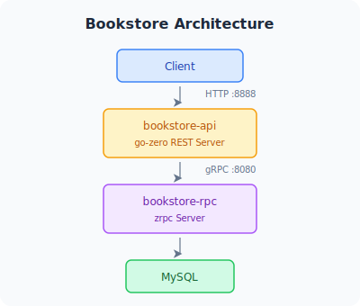

이 예제는 go-zero, MySQL, goctl을 사용해 API 서비스와 RPC 서비스를 함께 구성하는 방법을 보여 줍니다.

## 아키텍처



## 코드 가져오기

```bash
git clone https://github.com/zeromicro/go-zero.git
cd go-zero/example/bookstore
```

디렉터리 구조:

```
bookstore/
├── api/                    # HTTP 게이트웨이
│   ├── bookstore.go        # API 서비스 진입점
│   ├── etc/
│   │   └── bookstore-api.yaml
│   └── internal/
│       ├── config/
│       ├── handler/        # HTTP 핸들러
│       ├── logic/          # API 비즈니스 로직
│       ├── svc/            # ServiceContext
│       └── types/          # 요청/응답 타입
├── rpc/                    # gRPC 백엔드
│   ├── bookstore.go
│   ├── etc/
│   │   └── bookstore.yaml
│   ├── internal/
│   │   ├── config/
│   │   ├── logic/          # gRPC 로직
│   │   ├── model/          # MySQL 모델
│   │   └── svc/
│   └── pb/                 # protobuf 정의
└── shared/                 # 공유 코드
```

## 단계별 진행

### 1. 데이터베이스 생성

```sql
CREATE DATABASE bookstore;
USE bookstore;

CREATE TABLE `book` (
  `book`  varchar(255) NOT NULL COMMENT 'book name',
  `price` int          NOT NULL DEFAULT 0 COMMENT 'book price'
) ENGINE=InnoDB DEFAULT CHARSET=utf8mb4;
```

### 2. MySQL 모델 생성

```bash
cd rpc
goctl model mysql ddl -src ./internal/model/book.sql -dir ./internal/model -cache
```

### 3. 서비스 설정

```yaml title="rpc/etc/bookstore.yaml"
Name: bookstore.rpc
ListenOn: 0.0.0.0:8080

DataSource: root:password@tcp(127.0.0.1:3306)/bookstore?parseTime=true
Cache:
  - Host: 127.0.0.1:6379
```

```yaml title="api/etc/bookstore-api.yaml"
Name: bookstore-api
Host: 0.0.0.0
Port: 8888

Bookstore:
  Etcd:
    Hosts:
      - 127.0.0.1:2379
    Key: bookstore.rpc
```

### 4. ServiceContext — RPC 클라이언트 연결

```go title="api/internal/svc/servicecontext.go"
type ServiceContext struct {
    Config     config.Config
    Bookstore  bookstore.Bookstore   // 생성된 gRPC 클라이언트 스텁
}

func NewServiceContext(c config.Config) *ServiceContext {
    return &ServiceContext{
        Config:    c,
        Bookstore: bookstore.NewBookstore(zrpc.MustNewClient(c.Bookstore)),
    }
}
```

### 5. 서비스 시작

```bash
# 터미널 1: RPC 서비스 시작
cd rpc && go run bookstore.go -f etc/bookstore.yaml

# 터미널 2: API 서비스 시작
cd api && go run bookstore.go -f etc/bookstore-api.yaml
```

### 6. 테스트

```bash
# 책 추가
curl -X POST http://localhost:8888/add \
  -H "Content-Type: application/json" \
  -d '{"book":"The Go Programming Language","price":42}'
# {"ok":true}

# 책 가격 조회
curl "http://localhost:8888/check?book=The+Go+Programming+Language"
# {"price":42}
```

## 보여 주는 핵심 개념

| 개념 | 위치 | 설명 |
|---------|----------|-------------|
| API 정의 | `api/bookstore.api` | `.api` DSL로 REST 라우트 정의 |
| Proto 정의 | `rpc/pb/bookstore.proto` | gRPC 서비스 계약 |
| goctl 모델 | `rpc/internal/model/` | 캐시가 포함된 타입 안전 MySQL 접근 |
| ServiceContext | `api/internal/svc/` | 의존성 주입 컨테이너 |
| RPC 클라이언트 | `api/internal/logic/` | 로직 계층에서 gRPC 백엔드 호출 |
| etcd 디스커버리 | `api/etc/bookstore-api.yaml` | etcd로 RPC target 해석 |

## 자주 쓰는 goctl 명령

```bash
# API 코드 다시 생성
cd api && goctl api go -api bookstore.api -dir .

# RPC 코드 다시 생성
cd rpc && goctl rpc protoc pb/bookstore.proto \
  --go_out=./pb --go-grpc_out=./pb --zrpc_out=.

# SQL DDL에서 모델 다시 생성
goctl model mysql ddl -src ./internal/model/book.sql \
  -dir ./internal/model -cache
```
