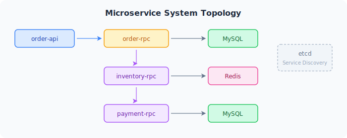

이 예제는 여러 go-zero 서비스가 etcd를 통해 서로를 찾고, gRPC로 통신하며, 메트릭과 추적을 내보내는 구성을 보여 줍니다.

## 서비스 개요



## 사전 준비

- `localhost:2379`에서 실행 중인 etcd
- 사용 가능한 MySQL과 Redis

## 서비스 설정

각 서비스는 etcd에 자신을 등록합니다.

```yaml title="etc/order-rpc.yaml"
Name: order.rpc
ListenOn: 0.0.0.0:8080
Etcd:
  Hosts:
    - 127.0.0.1:2379
  Key: order.rpc
```

## RPC 클라이언트 설정

API 서비스는 같은 etcd key를 사용해 RPC 서비스를 찾습니다.

```yaml title="etc/order-api.yaml"
OrderRpc:
  Etcd:
    Hosts:
      - 127.0.0.1:2379
    Key: order.rpc
```

## 관측 가능성

Prometheus 메트릭과 Jaeger 추적을 활성화합니다.

```yaml
Telemetry:
  Name: order-api
  Endpoint: localhost:4317
  Sampler: 1.0
  Batcher: otlpgrpc
```

## 보여 주는 핵심 개념

- etcd를 통한 서비스 디스커버리
- 여러 서비스를 거치는 RPC 호출 체인
- 서비스 전반의 분산 추적
- 실제 요청 흐름에서 동작하는 속도 제한과 서킷 브레이킹
