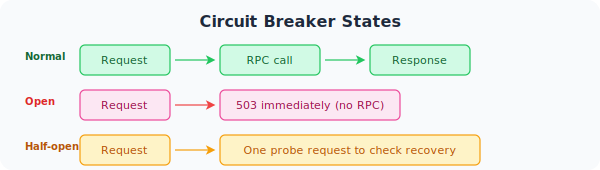

`zrpc.Client`은 go-zero's gRPC 클라이언트 wrapper. It integrates **서비스 디스커버리**, **P2C 부하 분산**, **서킷 브레이킹**,과 **OpenTelemetry 추적** automatically입니다.

## 옵션: Direct 연결 (Dev / 테스트)

```go title="internal/svc/servicecontext.go"
import (
    "github.com/zeromicro/go-zero/zrpc"
    "myservice/greeter"  // 생성된 proto 패키지
)

func NewServiceContext(c config.Config) *ServiceContext {
    conn, err := zrpc.NewClient(zrpc.RpcClientConf{
        Endpoints: []string{"localhost:8080"},
    })
    if err != nil {
        log.Fatal(err)
    }
    return &ServiceContext{
        Config:        c,
        GreeterClient: greeter.NewGreeterClient(conn.Conn()),
    }
}
```

## 옵션 B: 서비스 디스커버리 via etcd (프로덕션)

```yaml title="etc/app.yaml"
GreeterRpc:
  Etcd:
    Hosts:
      - 127.0.0.1:2379
    Key: greeter.rpc
  Timeout: 2000       # 예시입니다
  KeepaliveTime: 20000
```

```go title="internal/svc/servicecontext.go"
func NewServiceContext(c config.Config) *ServiceContext {
    return &ServiceContext{
        Config:        c,
        GreeterClient: greeter.NewGreeterClient(
            zrpc.MustNewClient(c.GreeterRpc).Conn(),
        ),
    }
}
```


## Making Call

```go title="internal/logic/hellologic.go"
func (l *HelloLogic) Hello(req *types.HelloReq) (*types.HelloResp, error) {
    resp, err := l.svcCtx.GreeterClient.SayHello(l.ctx, &greeter.SayHelloReq{
        Name: req.Name,
    })
    if err != nil {
        return nil, err
    }
    return &types.HelloResp{Message: resp.Message}, nil
}
```


## 설정 참조

```yaml
GreeterRpc:
  # Option 예시입니다
  Etcd:
    Hosts: [127.0.0.1:2379]
    Key: greeter.rpc

  # Option 예시입니다
  Endpoints:
    - 127.0.0.1:8080

  Timeout: 2000           # 예시입니다
  KeepaliveTime: 20000    # 예시입니다

  # Mutual TLS
  # App:
  # CertFile 예시입니다
  # KeyFile 예시입니다
  #   CaCert:   ca.pem
```

## 오류 처리


```go
import "google.golang.org/grpc/status"

resp, err := l.svcCtx.GreeterClient.SayHello(l.ctx, req)
if err != nil {
    st, _ := status.FromError(err)
    switch st.Code() {
    case codes.NotFound:
        return nil, errorx.NewCodeError(404, "user not found")
    case codes.DeadlineExceeded:
        return nil, errorx.NewCodeError(504, "upstream timeout")
    default:
        return nil, err
    }
}
```

## 서킷 브레이킹




없음 설정 needed — it's 자동 위한 모든 `zrpc.Client`.

## Adding 인터셉터


```go
conn, err := zrpc.NewClient(c.GreeterRpc,
    zrpc.WithUnaryClientInterceptor(func(
        ctx context.Context, method string,
        req, reply any, cc *grpc.ClientConn,
        invoker grpc.UnaryInvoker, opts ...grpc.CallOption,
    ) error {
        ctx = metadata.AppendToOutgoingContext(ctx,
            "x-request-id", requestIDFromCtx(ctx),
        )
        return invoker(ctx, method, req, reply, cc, opts...)
    }),
)
```

## 다음 단계

- [부하 분산](../interceptor) — how P2C 라우트 전반에 instances
