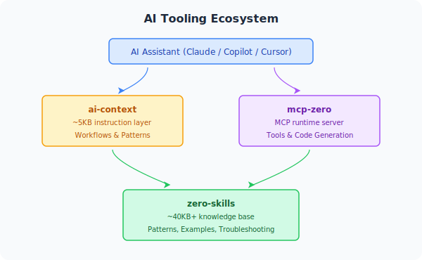

import { Card, CardGrid, Aside } from '@astrojs/starlight/components';


AI 지원 코딩 시대에는 AI 코딩 도우미가 프레임워크를 제대로 이해하고 규칙에 맞는 코드를 생성하도록 만드는 것이 중요합니다. go-zero 팀은 다음 세 프로젝트를 중심으로 완전한 AI 도구 생태계를 구축했습니다.

<CardGrid>
  <Card title="ai-context" icon="document">
    간결한 지시 레이어(~5KB)입니다. workflow, 도구 사용법, 빠른 참조 패턴을 통해 AI에게 **무엇을 해야 하는지** 알려 줍니다.
  </Card>
  <Card title="zero-skills" icon="open-book">
    상세한 지식 베이스(~40KB+)입니다. 패턴, 모범 사례, 문제 해결 정보를 통해 AI에게 **어떻게 잘 해야 하는지** 알려 줍니다.
  </Card>
  <Card title="mcp-zero" icon="rocket">
    런타임 MCP 서버입니다. 서비스 생성, 모델 생성, spec 검증처럼 AI가 **실제로 작업을 수행**할 수 있게 합니다.
  </Card>
</CardGrid>

## 함께 동작하는 방식



**예: REST API 생성**

1. AI가 `ai-context`를 읽고 `create_api_service` 도구 사용법을 익힙니다.
2. AI가 `mcp-zero`를 호출해 프로젝트 구조를 생성합니다.
3. AI가 `zero-skills`를 참조해 go-zero 관례에 맞는 Handler/Logic/Model 코드를 만듭니다.

## 도구별 설정

### GitHub Copilot

```bash
# ai-context를 submodule로 추가합니다(upstream 업데이트 추적 가능)
git submodule add https://github.com/zeromicro/ai-context.git .github/ai-context

# Copilot용 symlink를 생성합니다
ln -s ai-context/00-instructions.md .github/copilot-instructions.md

# 최신 버전으로 업데이트합니다
git submodule update --remote .github/ai-context
```

### Cursor

```bash
git submodule add https://github.com/zeromicro/ai-context.git .cursorrules
git submodule update --remote .cursorrules
```

Cursor는 `.cursorrules/` 안의 모든 `.md` 파일을 프로젝트 규칙으로 자동 읽습니다.

### Windsurf(Codeium)

```bash
git submodule add https://github.com/zeromicro/ai-context.git .windsurfrules
git submodule update --remote .windsurfrules
```

### Claude Desktop + mcp-zero

**1. mcp-zero 빌드**

```bash
git clone https://github.com/zeromicro/mcp-zero.git
cd mcp-zero
go build -o mcp-zero main.go
```

**2. Claude Desktop 설정**(macOS: `~/Library/Application Support/Claude/claude_desktop_config.json`)

```json
{
  "mcpServers": {
    "mcp-zero": {
      "command": "/path/to/mcp-zero",
      "env": {
        "GOCTL_PATH": "/Users/yourname/go/bin/goctl"
      }
    }
  }
}
```

**3.** Claude Desktop을 재시작합니다. 이제 Claude가 `mcp-zero` 도구를 사용해 go-zero 코드를 생성할 수 있습니다.

### Claude Code(CLI)

```bash
claude mcp add \
  --transport stdio \
  mcp-zero \
  --env GOCTL_PATH=/Users/yourname/go/bin/goctl \
  -- /path/to/mcp-zero

claude mcp list     # 확인
```

## 프로젝트 설명

### ai-context

**Repo:** https://github.com/zeromicro/ai-context

가벼운 지시 파일(~5KB)로 다음 내용을 제공합니다.

- **workflow**: 어떤 상황에서 어떤 도구를 사용할지
- **도구 사용법**: mcp-zero를 호출하는 방법
- **빠른 패턴**: 일반적인 작업을 위한 짧은 코드 snippet

ai-context의 의사결정 트리 예시:

```markdown
User Request →
├─ New API? → create_api_service → generate_api_from_spec
├─ New RPC? → create_rpc_service
├─ Database? → generate_model
└─ Modify? → Edit .api → generate_api_from_spec
```

### zero-skills

**Repo:** https://github.com/zeromicro/zero-skills

포괄적인 지식 베이스(~40KB+)입니다.

- **패턴**: REST API, RPC, database, resilience
- **모범 사례**: ✅ 올바른 예와 ❌ 흔한 실수를 함께 보여 주는 프로덕션 수준 코드 기준
- **문제 해결**: 자주 발생하는 문제의 해결책
- **시작하기**: 처음부터 끝까지 이어지는 예제

### mcp-zero

**Repo:** https://github.com/zeromicro/mcp-zero

10개 이상의 도구를 제공하는 [Model Context Protocol](./) 서버입니다.

- API / RPC 서비스 생성
- SQL에서 model 코드 생성
- `.api` spec과 `.proto` definition 검증
- go-zero 문서 조회
- 기존 프로젝트 구조 분석

## 도입 전과 후

**AI 도구 생태계가 없을 때:**

```text
개발자: user API를 만들어 줘

AI: 기본 HTTP handler 예시는 다음과 같습니다...
[go-zero 관례가 아닌 일반적인 Go HTTP 코드를 생성함]

개발자: go-zero는 그렇게 동작하지 않아. handler는 logic 계층을 호출해야 해.

AI: 죄송합니다. 수정된 코드는 다음과 같습니다...
[올바른 코드를 얻기까지 여러 번의 수정 요청이 필요함]
```

**AI 도구 생태계를 사용할 때:**

```text
개발자: user API를 만들어 줘

AI: go-zero의 3계층 아키텍처를 따르겠습니다...
[즉시 올바른 Handler → Logic → Model 구조를 생성함]
[적절한 오류 처리, context 전파, 검증을 포함함]

개발자: 완벽해! ✅
```

## 설계 원칙

| 원칙 | 이점 |
|-----------|---------|
| **계층화** — 속도를 위한 ai-context(5KB), 깊이를 위한 zero-skills(40KB+) | 빠른 응답과 깊은 지식을 함께 제공 |
| **단일 진실 공급원** — zero-skills를 표준 참조로 사용 | 한 번 업데이트하면 모든 도구에 반영 |
| **AI에 최적화된 구조** — ✅/❌ 예제와 구조화된 Markdown | AI가 더 잘 파싱하고 더 정확하게 출력 |
| **전체 수명 주기 지원** | 생성 → 생성 코드 갱신 → 디버깅 → 최적화 |

<Aside type="tip">
submodule을 사용하면 프로젝트가 ai-context와 zero-skills의 upstream 업데이트를 쉽게 추적할 수 있습니다. 최신 버전을 가져오려면 `git submodule update --remote`를 실행하세요.
</Aside>

## 관련 문서

- [MCP 서버 개요](./)
- [MCP 서버 참조](../servers/)
