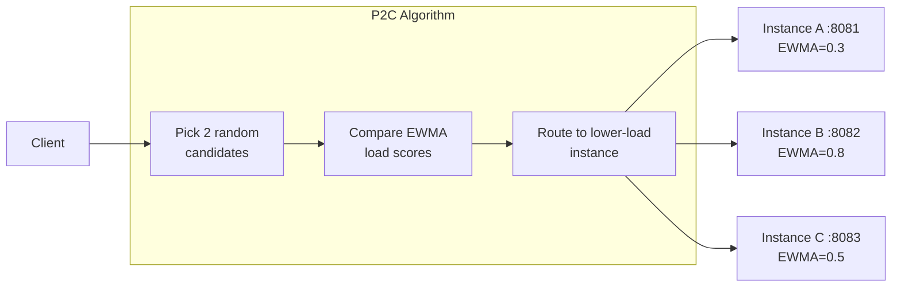

## How P2C + EWMA 작동합니다



1. 이 항목은 해당 기능의 사용 방법, 설정, 주의 사항을 설명합니다.
2. Compare their **EWMA (Exponentially Weighted Moving Average)** 부하 score.
3. 라우트 Request 로 **lower-load** instance.
4. 후에 응답, 업데이트 EWMA 사용하여 actual round-trip time.

**Why better than round-robin?**
- Round-robin distributes *요청*, 아님 *부하*. 느린 instances pile up.
- P2C 라우트 away 에서 느린 instances 자동으로, 없이 전역 coordination.

## 자동 Activation


```yaml title="etc/api.yaml"
OrderRpc:
  Etcd:
    Hosts:
      - 127.0.0.1:2379
    Key: order.rpc
```


## Static 엔드포인트 (Dev / 테스트)


```yaml
OrderRpc:
  Endpoints:
    - 127.0.0.1:8080
    - 127.0.0.1:8081
    - 127.0.0.1:8082
```

## Direct 연결 (Single Instance)

```yaml
OrderRpc:
  Target: "direct://127.0.0.1:8080"
```

## Kubernetes DNS


```yaml
OrderRpc:
  Target: "k8s:// 예시입니다
```

## Observing Balancer


```yaml title="etc/api.yaml"
Prometheus:
  Host: 0.0.0.0
  Port: 9101
  Path: /metrics
```

Key 메트릭:

| Metric | 설명 |
|---|---|
| `rpc_client_requests_total{target="..."}` | Request count 별 upstream instance |
| `rpc_client_duration_ms_bucket{target="..."}` | Latency histogram 별 instance |


## 타임아웃과 Keep-alive

```yaml
OrderRpc:
  Etcd:
    Hosts: [127.0.0.1:2379]
    Key: order.rpc
  Timeout: 2000           # 예시입니다
  KeepaliveTime: 20000    # 예시입니다
```


## 다음 단계

- [서비스 디스커버리](../service-discovery) — register과 discover 서비스 사용하여 etcd
- [분산 추적](../distributed-tracing) — 추적 요청 전반에 instances
