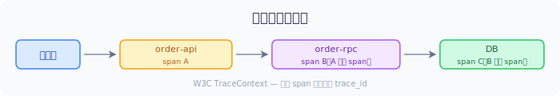

go-zero 基于 OpenTelemetry 实现分布式追踪。每个 HTTP 请求、zrpc 调用和 SQL 查询都会自动创建 span——常规链路无需任何手动埋点。

:::tip
想要动手实操？请参阅 [分布式链路追踪指南](/zh-cn/guides/microservice/distributed-tracing/)，其中有 Jaeger 的配套教程。
:::

## 配置

```yaml title="etc/app.yaml"
Telemetry:
  Name: order-api             # 在追踪 UI 中显示的服务名称
  Endpoint: localhost:4317     # OTLP gRPC 端点
  Sampler: 1.0                # 1.0 = 100% 采样；高流量生产环境建议 0.1
  Batcher: otlpgrpc           # 详见下方后端列表
```

## 自动追踪覆盖范围

| 层 | span 包含信息 |
|----|--------------|
| 入站 HTTP 请求 | URL、方法、HTTP 状态码 |
| 出站 zrpc 调用 | gRPC 服务名 + 方法名 |
| SQL 查询（sqlx） | 查询语句、影响行数 |
| Redis 命令 | 命令名称、key 前缀 |

## 跨服务追踪传播

go-zero 使用 **W3C TraceContext** 标准（`traceparent` 请求头）在服务间传播追踪上下文。API 服务调用 RPC 服务时，trace ID 和 span ID 自动流转——整条调用链在 Jaeger 或 Zipkin 中呈现为单一 trace。



RPC 服务端侧无需任何代码——gRPC 拦截器自动从入站 metadata 中提取上下文。

## 自定义 Span

在业务 logic 中添加应用级 span：

```go
import (
    "go.opentelemetry.io/otel"
    "go.opentelemetry.io/otel/attribute"
    "go.opentelemetry.io/otel/codes"
)

func (l *OrderLogic) processPayment(amount int64) error {
    tracer := otel.Tracer("order-service")
    ctx, span := tracer.Start(l.ctx, "process-payment")
    defer span.End()

    span.SetAttributes(
        attribute.Int64("amount", amount),
        attribute.String("currency", "CNY"),
        attribute.String("provider", "alipay"),
    )

    if err := chargeCard(ctx, amount); err != nil {
        span.RecordError(err)
        span.SetStatus(codes.Error, err.Error())
        return err
    }
    return nil
}
```

## Trace ID 注入日志

同时配置 `logx` 和 `Telemetry` 时，go-zero 自动将 trace ID 和 span ID 注入每一条日志：

```json
{"level":"info","trace_id":"4bf92f3577b34da6a3ce929d0e0e4736","span_id":"00f067aa0ba902b7","msg":"订单已创建","orderId":"ord_123"}
```

可以从 Jaeger 的某个 trace span 直接跳转到该请求对应的日志行。

## 采样策略

| 策略 | 配置 | 适用场景 |
|------|------|---------|
| 全量采样 | `Sampler: 1.0` | 开发环境、预发布环境 |
| 10% 采样 | `Sampler: 0.1` | 高流量生产环境 |
| 低频采样 | `Sampler: 0.01` | 超高吞吐（>10k req/s） |

基于比例的采样器在 trace 根节点（API 网关）做决策，同一 trace 下所有下游 span 自动跟随包含或排除。

## 后端支持

| 后端 | `Batcher` 值 | Endpoint 格式 |
|------|-------------|--------------|
| OTLP gRPC | `otlpgrpc`（默认） | `otel-collector:4317` |
| OTLP HTTP | `otlphttp` | `http://otel-collector:4318` |
| Zipkin | `zipkin` | `http://zipkin:9411/api/v2/spans` |
| 文件 | `file` | （写入本地文件） |

:::caution
`jaeger` batcher 已在 **go-zero v1.10.0** 中移除（[#5361](https://github.com/zeromicro/go-zero/pull/5361)），原因是 OpenTelemetry 官方已废弃 Jaeger exporter。如果升级到 v1.10.0+ 后仍使用 `Batcher: jaeger`，服务将启动失败：

```
value "jaeger" is not defined in options "[zipkin otlpgrpc otlphttp file]"
```

请参阅下方 [从 Jaeger Batcher 迁移](#从-jaeger-batcher-迁移)。
:::

### 通过 OTLP 接入 Jaeger（Docker）

Jaeger 1.35+ 原生支持 OTLP 协议，使用 `all-in-one` 镜像并启用 OTLP：

```bash
docker run -d --name jaeger \
  -e COLLECTOR_OTLP_ENABLED=true \
  -p 16686:16686 \
  -p 4317:4317 \
  -p 4318:4318 \
  jaegertracing/all-in-one:latest
# UI 访问：http://localhost:16686
```

```yaml title="etc/app.yaml"
Telemetry:
  Name: order-api
  Endpoint: localhost:4317
  Sampler: 1.0
  Batcher: otlpgrpc
```

### OpenTelemetry Collector

生产环境建议通过 OTel Collector 路由追踪数据，实现多后端分发：

```yaml title="etc/app.yaml"
Telemetry:
  Name: order-api
  Endpoint: otel-collector:4317
  Batcher: otlpgrpc
  Sampler: 0.1
```

## 关闭追踪

将 `Sampler` 设为 `0` 或移除整个 `Telemetry` 块即可完全关闭追踪开销。

## 从 Jaeger Batcher 迁移

从 **go-zero v1.10.0** 起，`jaeger` batcher 已被移除，因为上游 [OpenTelemetry Jaeger exporter 已被官方废弃](https://opentelemetry.io/blog/2023/jaeger-exporter-collector-migration/)。Jaeger 自 v1.35 起已原生支持 OTLP 协议，因此你仍然可以使用 Jaeger——只需切换到 OTLP exporter。

### 第一步：更新 Docker Compose / Jaeger 部署

确保你的 Jaeger 实例暴露 OTLP 端口（`4317` 为 gRPC，`4318` 为 HTTP）：

```yaml title="docker-compose.yaml"
services:
  jaeger:
    image: jaegertracing/all-in-one:latest
    environment:
      - COLLECTOR_OTLP_ENABLED=true
    ports:
      - "16686:16686"   # Jaeger UI
      - "4317:4317"     # OTLP gRPC
      - "4318:4318"     # OTLP HTTP
    restart: unless-stopped
```

:::tip
如果宿主机上 `4317`/`4318` 端口被占用，可以映射到其他端口（如 `34317:4317`），然后相应修改 `Endpoint` 配置。
:::

### 第二步：更新 YAML 配置

将旧的 Jaeger 专用配置替换为 OTLP：

```diff
 Telemetry:
   Name: my-service
-  Endpoint: http://jaeger:14268/api/traces
-  Batcher: jaeger
+  Endpoint: jaeger:4317
+  Batcher: otlpgrpc
   Sampler: 1.0
```

或者使用 OTLP HTTP：

```diff
 Telemetry:
   Name: my-service
-  Endpoint: http://jaeger:14268/api/traces
-  Batcher: jaeger
+  Endpoint: http://jaeger:4318
+  Batcher: otlphttp
   Sampler: 1.0
```

### 第三步：重启并验证

重启服务后打开 Jaeger UI `http://localhost:16686`，链路数据将如之前一样正常显示——唯一的区别是传输协议。

### 快速对照表

| 迁移前（< v1.10.0） | 迁移后（>= v1.10.0） |
|---------------------|---------------------|
| `Batcher: jaeger` | `Batcher: otlpgrpc`（推荐）或 `otlphttp` |
| `Endpoint: http://jaeger:14268/api/traces` | `Endpoint: jaeger:4317`（gRPC）或 `http://jaeger:4318`（HTTP） |
| Jaeger 镜像：任意版本 | Jaeger 镜像：**1.35+**（原生 OTLP 支持） |
