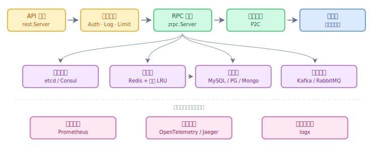
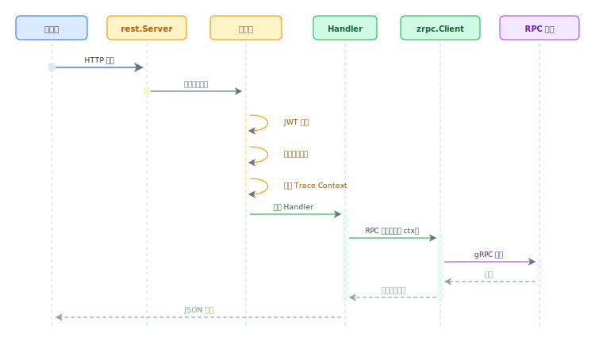
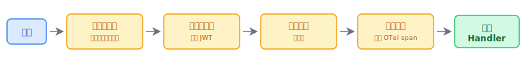
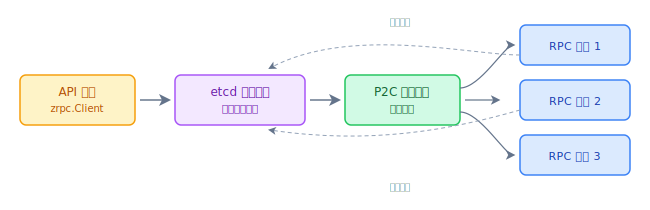
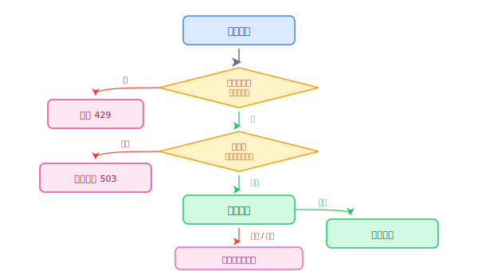
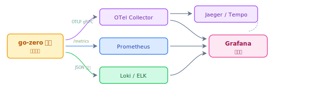

go-zero 是一套完整的微服务框架，采用分层架构，为从 API 网关到底层基础设施的每个关注点提供专用组件。

## 系统结构图



## 各层职责

| 层级 | 组件 | 职责 |
|---|---|---|
| API 层 | `rest.Server` | HTTP/1.1、HTTP/2、WebSocket；JWT 认证；速率限制 |
| RPC 层 | `zrpc.Server/Client` | gRPC 通信；P2C 负载均衡；熔断器 |
| 服务发现 | etcd / Consul | 实例注册、健康检查、Watch 推送 |
| 缓存层 | Redis + LRU | 双层缓存；WriteThrough；7 天 TTL |
| 可观测性 | OTel + Prometheus | 统一 Traces / Metrics / Logs |

## HTTP 请求生命周期



## 中间件链



中间件通过 `server.Use(middleware)` 注册，支持全局或按路由挂载。

## API 网关与 RPC 服务联动



API 服务通过 etcd 动态感知 RPC 实例的上线与下线，无需任何人工干预。

## 韧性机制：速率限制与熔断



## 可观测性流水线



## 配置层次结构

go-zero 配置可以内嵌组合：

```yaml
Name: user-api
Host: 0.0.0.0
Port: 8888

# 嵌入 REST 配置
MaxConns: 1000       # 最大并发连接数
Timeout: 5000        # 全局请求超时（毫秒）

# 下游 RPC 依赖
UserRpc:
  Etcd:
    Hosts: [127.0.0.1:2379]
    Key: user.rpc
  Timeout: 2000

# 缓存
CacheRedis:
  - Host: 127.0.0.1:6379
    Type: node

# 可观测性
Telemetry:
  Name: user-api
  Endpoint: http://jaeger:14268/api/traces
  Sampler: 1.0
  Batcher: jaeger
```

## 延伸阅读

- [快速开始](../../guides/quickstart/) — 5 分钟运行第一个 go-zero 服务
- [gRPC 客户端](../../guides/grpc/client) — zrpc.Client 完整配置参考
- [分布式链路追踪](../../guides/microservice/distributed-tracing) — 端到端追踪配置
