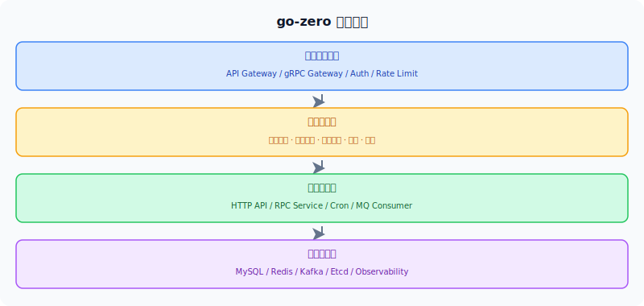

# 架构设计

## 概述

go-zero 通过分层设计把入口流量、服务治理、业务逻辑和基础设施解耦。

## 架构图

*从入口到基础设施的分层结构，便于演进与扩缩容。*

## 核心层次

### 层次一：网关层

- 接入 HTTP / gRPC 请求
- 请求校验与统一鉴权

### 层次二：服务治理层

- 负载均衡与服务发现
- 限流、熔断、降载、超时

### 层次三：业务服务层

- 领域逻辑编排
- 读写数据库与缓存

### 层次四：基础设施层

- 消息队列、存储、配置中心
- 指标、日志、链路追踪

## 设计原则

1. **默认高可用**：将治理能力内建为基础能力。
2. **约定优于配置**：统一目录结构和生成模板。
3. **关注可维护性**：逻辑与依赖拆分清晰。

## 下一步

- [设计原则](./design-principles.md)
- [项目结构](./project-structure.md)
