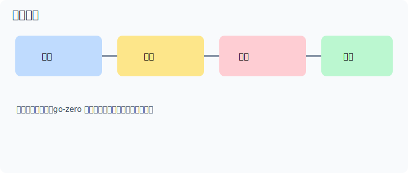

## 约定优于配置

goctl 脚手架和标准化目录减少了团队层面的分歧，提高了协作效率。每位工程师在 go-zero 项目中看到的都是相同的布局：

```text
internal/handler/   ← 仅 HTTP 绑定
internal/logic/     ← 仅业务逻辑
internal/svc/       ← 共享依赖
internal/model/     ← 仅数据访问
```

当目录结构是确定的，代码审查就能聚焦于内容本身而非风格。

## 以稳定性为中心

弹性机制作为框架能力内建，而非可选附加项。熔断、限流、负载卸除和超时控制在零配置下自动生效：

```go
// 这一行代码受到以下保护：
// - P2C 负载均衡
// - 熔断器（Google SRE 风格）
// - 来自 ctx 的 per-RPC deadline
// - Prometheus 指标
// - OpenTelemetry span
resp, err := l.svcCtx.OrderRpc.CreateOrder(l.ctx, req)
```



## 分层与职责清晰

Handler、Logic、ServiceContext 和 Model 被有意分离以降低耦合：

```go
// handler — 仅解码请求并调用 logic
func (h *CreateOrderHandler) ServeHTTP(w http.ResponseWriter, r *http.Request) {
    var req types.CreateOrderReq
    if err := httpx.Parse(r, &req); err != nil {
        httpx.ErrorCtx(r.Context(), w, err)
        return
    }
    l := logic.NewCreateOrderLogic(r.Context(), h.svcCtx)
    resp, err := l.CreateOrder(&req)
    httpx.OkJsonCtx(r.Context(), w, resp)
}

// logic — 仅实现业务规则
func (l *CreateOrderLogic) CreateOrder(req *types.CreateOrderReq) (*types.CreateOrderResp, error) {
    // 校验、调用 model、调用下游 RPC
    order, err := l.svcCtx.OrderModel.Insert(l.ctx, &model.Order{
        UserId:  req.UserId,
        Product: req.Product,
    })
    if err != nil {
        return nil, err
    }
    return &types.CreateOrderResp{OrderId: order.Id}, nil
}
```

这一边界是由代码生成强制保证的 — goctl 永远不会将业务逻辑放入 handler。

## 可观测优先

生产级系统从第一天起就需要日志、指标和链路追踪，而非等到事故发生后。go-zero 自动将这三者注入每个请求：

```go
// logx 自动在每行日志中写入 trace_id + span_id
logx.Infow("order created", logx.Field("orderId", id))
// JSON 输出：{"level":"info","trace_id":"4bf92f35...","span_id":"00f067aa","orderId":"ord_123"}

// Prometheus 计数器按请求/响应码自动递增 — 无需额外代码
// go_zero_http_server_requests_total{method="POST",path="/order",code="200"}
```

在 `etc/user-api.yaml` 中添加四行即可启用分布式追踪：

```yaml
Telemetry:
  Name: user-api
  Endpoint: http://jaeger:14268/api/traces
  Sampler: 1.0
```
