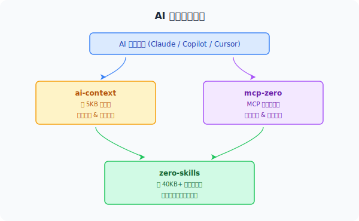

import { Card, CardGrid, Aside } from '@astrojs/starlight/components';


在 AI 辅助编程时代，如何让大模型真正理解你使用的框架，生成符合框架规范的代码？go-zero 团队构建了一套完整的 AI 工具生态，包括 **ai-context**、**zero-skills** 和 **mcp-zero** 三个项目，让 Claude、GitHub Copilot、Cursor 等 AI 编程助手成为你的 go-zero 专家。

<CardGrid>
  <Card title="ai-context" icon="document">
    简洁的指令层（约 5KB），告诉 AI **做什么** — 工作流程、工具使用、快速代码片段
  </Card>
  <Card title="zero-skills" icon="open-book">
    详细的知识库（约 40KB+），告诉 AI **怎么做好** — 模式、最佳实践、故障排查
  </Card>
  <Card title="mcp-zero" icon="rocket">
    运行时 MCP 服务，让 AI 能**真正动手做** — 创建服务、生成模型、验证规范
  </Card>
</CardGrid>

## 协同工作原理



**示例：创建新的 REST API**
1. AI 读取 `ai-context` → 了解应该用 `create_api_service` 工具
2. AI 调用 `mcp-zero` → 执行代码生成，创建项目结构
3. AI 参考 `zero-skills` → 生成符合 Handler/Logic/Model 三层架构的完整实现

## 各工具配置方式

### GitHub Copilot

```bash
# 添加 ai-context 作为 submodule（自动跟踪上游更新）
git submodule add https://github.com/zeromicro/ai-context.git .github/ai-context

# 创建符号链接
ln -s ai-context/00-instructions.md .github/copilot-instructions.md

# 更新到最新版本
git submodule update --remote .github/ai-context
```

### Cursor

```bash
git submodule add https://github.com/zeromicro/ai-context.git .cursorrules
git submodule update --remote .cursorrules
```

Cursor 会自动读取 `.cursorrules` 目录下的所有 `.md` 文件作为项目规则。

### Windsurf (Codeium)

```bash
git submodule add https://github.com/zeromicro/ai-context.git .windsurfrules
git submodule update --remote .windsurfrules
```

### Claude Desktop + mcp-zero

**1. 安装 mcp-zero：**

```bash
git clone https://github.com/zeromicro/mcp-zero.git
cd mcp-zero
go build -o mcp-zero main.go
```

**2. 配置 Claude Desktop**（macOS：`~/Library/Application Support/Claude/claude_desktop_config.json`）：

```json
{
  "mcpServers": {
    "mcp-zero": {
      "command": "/path/to/mcp-zero",
      "env": {
        "GOCTL_PATH": "/Users/yourname/go/bin/goctl"
      }
    }
  }
}
```

**3.** 重启 Claude Desktop，开始使用。

### Claude Code（命令行）

```bash
claude mcp add \
  --transport stdio \
  mcp-zero \
  --env GOCTL_PATH=/Users/yourname/go/bin/goctl \
  -- /path/to/mcp-zero

claude mcp list   # 验证配置
```

## 三大项目详解

### ai-context

**仓库**：https://github.com/zeromicro/ai-context

轻量级指令文件（约 5KB），提供：
- **工作流程**：何时使用哪个工具
- **工具使用**：如何调用 mcp-zero
- **快速模式**：常见任务的快速代码片段

ai-context 中的决策树示例：
```markdown
User Request →
├─ New API? → create_api_service → generate_api_from_spec
├─ New RPC? → create_rpc_service
├─ Database? → generate_model
└─ Modify? → Edit .api → generate_api_from_spec
```

### zero-skills

**仓库**：https://github.com/zeromicro/zero-skills

详细知识库（约 40KB+）：
- **详细模式**：REST API、RPC、数据库、弹性保护
- **最佳实践**：生产级代码规范，含 ✅ 正确做法 + ❌ 错误做法对比
- **故障排查**：常见问题解决方案
- **快速开始**：从零到一的完整示例

### mcp-zero

**仓库**：https://github.com/zeromicro/mcp-zero

基于 [Model Context Protocol](./) 的工具服务，提供 10+ 个工具：
- 创建 API/RPC 服务
- 从 SQL 生成 model 代码
- 验证 `.api` spec 和 `.proto` 定义
- 查询 go-zero 文档
- 分析现有项目结构

## 使用前后对比

**没有 go-zero AI 工具生态：**
```
开发者：创建一个用户 API

AI：好的，这是基本的 HTTP handler...
[生成通用的 Go HTTP 代码，不符合 go-zero 规范]

开发者：这不是 go-zero 的写法，handler 应该调用 logic 层

AI：抱歉，这是修改后的代码...
[多轮对话才能得到正确的代码]
```

**使用 go-zero AI 工具生态：**
```
开发者：创建一个用户 API

AI：好的，我将按照 go-zero 的三层架构创建...
[直接生成符合规范的 Handler → Logic → Model 代码]
[包含正确的错误处理、上下文传递、数据验证]

开发者：完美！✅
```

## 核心设计理念

| 设计原则 | 优势 |
|---------|------|
| **分层设计** — ai-context（5KB）快速加载，zero-skills（40KB+）深度学习 | 快速响应 + 深度知识 |
| **单一数据源** — zero-skills 是规范的权威来源 | 一处更新，全局生效 |
| **AI 优化的内容组织** — ✅/❌ 示例, 结构化 Markdown | AI 更易解析和输出 |
| **覆盖完整开发周期** | 创建 → 生成 → 调试 → 优化 |

<Aside type="tip">
使用 submodule 方式可以让项目自动跟踪 ai-context 和 zero-skills 的上游更新。运行 `git submodule update --remote` 即可拉取最新内容。
</Aside>

## 相关文档

- [MCP 服务概述](./)
- [MCP Servers 参考](../servers/)
